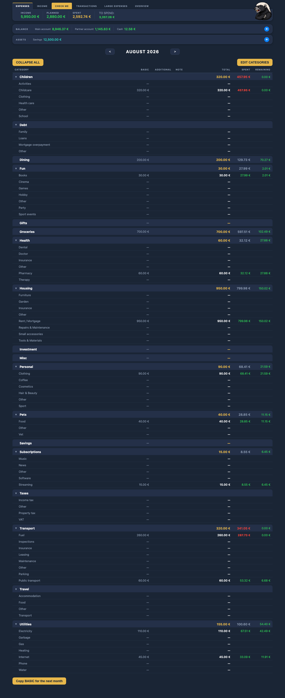
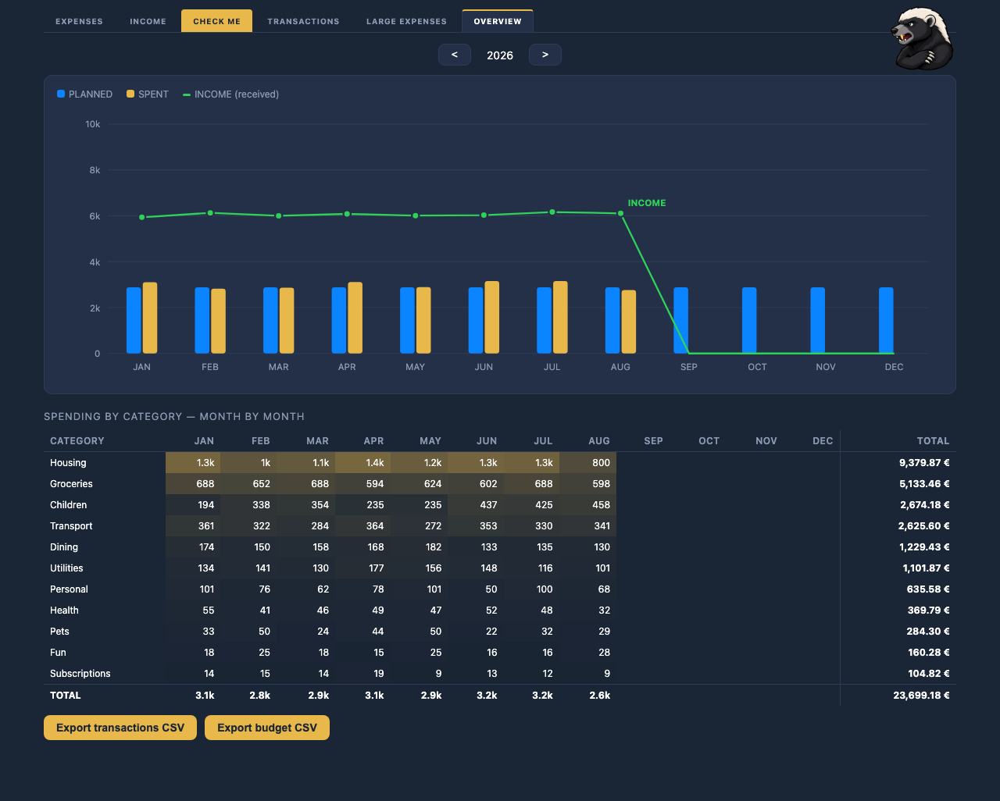
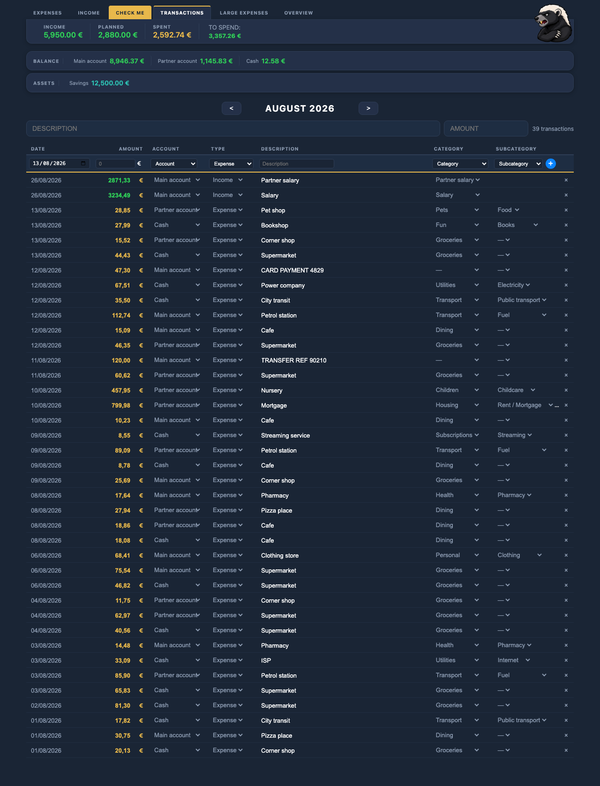
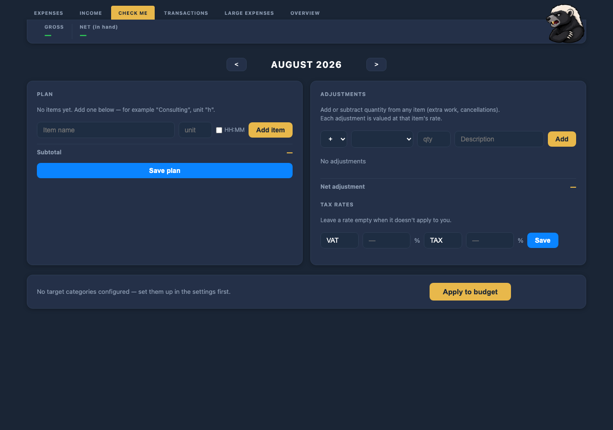
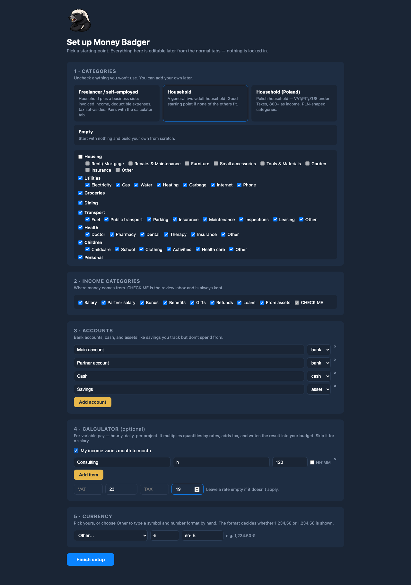

<p align="center">
  
</p>

<h1 align="center">Money Badger</h1>

<p align="center"><strong>Self-hosted household budgeting that remembers the <em>why</em>.</strong></p>

Most budgeting apps let you plan an amount and then lose the reason behind it —
a month later nobody remembers what that €1,600 in *Housing: Repairs* was for.
Money Badger keeps the plan, the actual spending, the notes and an optional
bank-import pipeline in one place, on your own hardware, with no account to sign
up for and nothing phoning home.

It runs on a Raspberry Pi.



## What it does

| Tab | |
|---|---|
| **EXPENSES** | Monthly budget per category: recurring amounts plus one-off entries with notes, live spent/remaining, account balances |
| **INCOME** | Planned vs received per income source, copy this month's plan into the next |
| **CHECK ME** | Review inbox for imported transactions nothing matched — the tab lights up when it has something |
| **TRANSACTIONS** | Full list: search, inline edit, manual add, transfers between accounts |
| **LARGE EXPENSES** | Yearly one-off projects, with progress against the plan |
| **OVERVIEW** | Year chart and a category × month matrix, plus CSV export |
| **CALCULATOR** | Optional. Turns variable pay — hours, shifts, units — into a planned income figure and sets aside the tax |
| **Mobile** | Installable PWA at `/m`: three taps to log an expense, works offline and syncs when you're back |

<details>
<summary>More screenshots</summary>





</details>

## Three ways to run it

Same code, and you can move up later without reinstalling.

| | What you get | What it needs |
|---|---|---|
| **Basic** | Everything above. You enter transactions yourself, on the phone or the web. | Python 3.9+ |
| **+ bank sync** | Transactions pulled from your bank daily and categorized by keyword rules. Whatever the rules don't recognize waits in CHECK ME. | An [Enable Banking](docs/ENABLE_BANKING.md) account (free tier is enough for a household) |
| **+ automatic categorization** | An LLM categorizes what the rules missed, and learns new rules from every correction you make. | An Anthropic API key, or a local model via Ollama — nothing leaves your network in that case |

The rules improve on their own: every time you fix a category in CHECK ME, that
correction is turned into a rule. After a few months most transactions never
reach the LLM at all.

## Install

```bash
git clone https://github.com/szymonwycz/money-badger.git
cd money-badger
./install.sh
```

The installer checks what's on the machine, asks for a port, a variant and a
password, builds a virtualenv, and writes the config. Then open the address it
prints and pick your categories, accounts and currency in the browser.



It renders systemd units into `deploy/rendered/` but stops short of installing
them, since that needs root — it prints the three commands to run.

**Try it first:** point it at a throwaway database with invented data.

```bash
BUDGET_DB=/tmp/demo.db python3 tools/demo_seed.py
BUDGET_DB=/tmp/demo.db venv/bin/gunicorn --bind 127.0.0.1:5055 app:app
```

## Telegram notifications

Optional, and worth the five minutes if you run the bank sync: a sync that quietly
stops returning data is otherwise something you notice weeks later. You get a short
message after each sync and the nightly audit report in the morning.

`install.sh` offers to set this up. To do it by hand, or to add it later:

1. Message [@BotFather](https://t.me/BotFather) on Telegram and send `/newbot`.
   Follow the two prompts (a display name, then a username ending in `bot`).
   It replies with a token that looks like `123456789:AAHxyz...`.
2. Message [@userinfobot](https://t.me/userinfobot). It replies with your numeric
   chat id.
3. Send your new bot any message — one is enough. A bot cannot open a conversation
   with you, so until you do this every notification fails silently.
4. Put both in `.env` and restart:

```bash
TELEGRAM_BOT_TOKEN=123456789:AAHxyz...
TELEGRAM_CHAT_ID=987654321
```

Check it works:

```bash
venv/bin/python notify_telegram.py "hello from Money Badger"
```

Prints `OK` and the message lands, or `FAILED` and the reason. Leave either value
empty and notifications are simply skipped — nothing else changes.

**Give this app its own bot** rather than reusing one you already run. The token is
the entire credential: any script holding it can read the bot's messages and post
as it, so one bot shared across projects means a leak anywhere is a leak everywhere.
Bots are free and take a minute to create.

## A word about access

Everyone in the household signs in under their own name and they all see the
same budget — an account records who added a transaction, it does not split the
money up. Set a password at install unless the only thing that can reach the
port is the machine you're sitting at.

That password becomes the first account, called `admin` unless `MB_ADMIN_USER`
says otherwise. From the ACCOUNT tab it adds everyone else, resets a forgotten
password and removes a login when someone leaves; everybody changes their own
password there too. Nobody, that first account included, can read anyone else's
password — only hashes are stored, so a forgotten one is reset, never looked up.

Upgrading an older install needs no work: the hash already in `MB_PASSWORD_HASH`
becomes the admin account on the next start, and the sessions that were open at
the time stay open.

With `MB_PASSWORD_HASH` empty the login is disabled and **every endpoint is open
to anyone who can connect**, including the full transaction export and delete.
The app says so in its startup log rather than leaving you to find out.

Five wrong passwords from one address locks that address out for 15 minutes, and
every failure is logged, so a script cannot grind away at a weak password. If
anything in front of the app terminates TLS — a reverse proxy with a certificate,
a Tailscale funnel — set `MB_HTTPS=1` so the session cookie is marked `Secure` and
never travels over plain HTTP.

## Customize me

- **Connect your bank** — [docs/ENABLE_BANKING.md](docs/ENABLE_BANKING.md) walks through
  registering an application, the consent flow, and what to put in `sync/config.json`.
- **Teach it your bank's wording** — `filters` in `sync/config.json` decides what counts
  as a transfer between your own accounts, a cash withdrawal, or a card top-up whose
  second leg must be ignored. The shipped example is in English; every bank words these
  differently.
- **Split a bundled payment** — one transfer that really pays three things becomes three
  categorized expenses via `split_rules`.
- **Use a local model** — set `LLM_PROVIDER=openai` and `LLM_BASE_URL` to an Ollama or
  LM Studio endpoint. Any OpenAI-compatible server works.
- **Change what the calculator computes** — it is a list of items with rates and two
  configurable tax rates, so it fits hourly, daily, per-project or per-shift pay. Leave
  a tax rate empty and it disappears.
- **Match receipts from email** — the Allegro matcher reads order confirmations from a
  Gmail label to fill in what a card payment actually bought. Poland-specific as written,
  but a decent template for any receipt-by-email flow.

See [docs/CONFIGURATION.md](docs/CONFIGURATION.md) for every setting.

## How it fits together

```
     phone / laptop
          │  HTTP (optionally behind nginx or a VPN)
          ▼
   gunicorn ── Flask (app.py)
          │
   SQLite budget.db   WAL, versioned migrations
          ▲
          │  HTTP, same API you use
   sync pipeline (daily, systemd timer)
   bank → filter → rules → LLM → CSV → /api/transactions/bulk
```

The pipeline never opens the database directly. That's what makes the variants
work: turn the whole pipeline off and the app doesn't notice.

[docs/ARCHITECTURE.md](docs/ARCHITECTURE.md) covers the data model and the
decisions behind it — how balances are computed from a checkpoint plus
transactions, why one gunicorn worker, and which invariants the tests protect.

## Tests

```bash
venv/bin/pip install -r requirements-dev.txt
venv/bin/pytest tests/ sync/ -q      # ~130 tests, throwaway database
node tests/test_offline_queue.mjs    # the PWA's offline write queue

venv/bin/playwright install chromium
BASE=http://127.0.0.1:5055 python3 tests/ui_smoke.py   # against a running instance
```

The Python suite never touches `budget.db`.

## Repository layout

```
app.py             Flask backend, all routes
migrations.py      versioned schema migrations
presets.py         starter categories and accounts for a new install
presets/           the presets themselves, as JSON
budget_client.py   the pipeline's only route to the app's API
templates/         one page per tab
static/            one script per tab, design tokens, PWA assets
sync/              bank fetch, filtering, rules, LLM, nightly self-check
deploy/            systemd and nginx templates, backup script
tools/             demo data generator
docs/              architecture, API, deployment, configuration
```

Your data and configuration — `budget.db`, `.env`, `sync/config.json`,
`sync/rules.json` — are gitignored. The repo ships `.example` versions.

## License

MIT. See [LICENSE](LICENSE).
